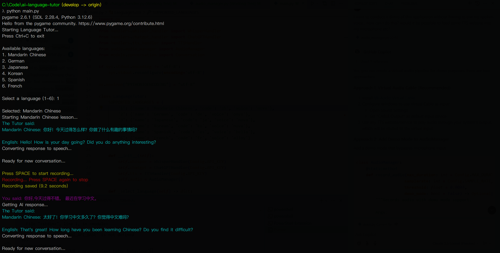
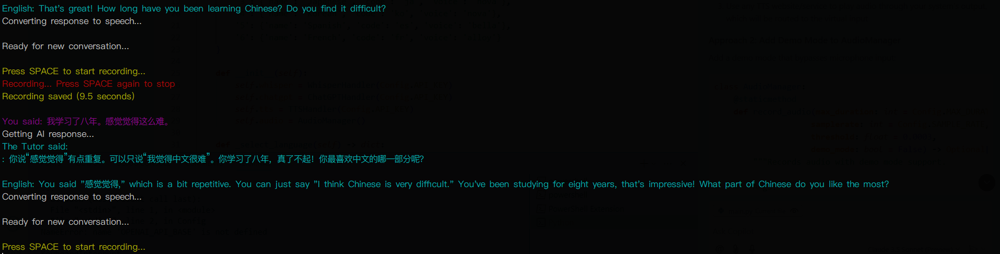

# ai-language-tutor 🎓
An interactive language learning tool powered by OpenAI's GPT-4, Whisper, and Text-to-Speech APIs.

## Features 🌟
<ul>
  <li><b>Voice Recognition</b>: Speak in your target language and get real-time transcription</li>
  <li><b>Intelligent Responses</b>: Context-aware conversations with a virtual tutor</li>
  <li><b>Text-to-Speech</b>: Hear correct pronunciation of phrases in your target language</li>
  <li><b>Conversation History</b>: Maintains context for natural dialogue flow</li>
  <li><b>Noise Reduction</b>: Advanced audio processing for clear voice capture</li>
  <li><b>Preconfigured Target Languages</b>: Comes with six pre-configured target languages to choose from, and the option to easily add new ones as per user need.
    <ul>
      <li>Preconfigured for: Mandarin Chinese, German, Japanese, Korean, Spanish, French]</li>
    </ul>
  </li>
</ul>
 
## Prerequisites 📋
<ul>
  <li>Python 3.8 or higher</li>
  <li>An OpenAI API key</li>
  <li>Windows</li>
  <li>Microphone for voice input</li>
  <li>Speakers for audio output</li>
  <li>A console able to output Unicode characters if using a language with Unicode characters (e.g., Chinese)
      <ul>
        <li>(I use <a href="https://cmder.app/">Cmder</a>!)</li>
      </ul>
</ul>

## Installation 🔧
<ul>
<li>Clone the repository:</li>
  
```bash
git clone https://github.com/yourusername/ai-language-tutor.git
cd ai-language-tutor
```
<li>Install required packages:</li>

```bash
pip install -r requirements.txt
```
  <li>Ensure your AI API key has been configured in your environment variables under 'OPENAI_API_KEY'</li>
  <li>If your target is not one of the preconfigured languages (Mandarin Chinese, German, Japanese, Korean, Spanish, French), add a new entry in SUPPORTED_LANGUAGES with the following attributes:
    <ul>
  <li><i>id</i>: Unique identifier when choosing the language in the command line.</li>
  <li><i>name</i>: A string representation fo the language. Used to inform OpenAI what language to expect.</li>
  <li><i>code</i>: The ISO 639 representation for the language, used when parsing the text to ensure characters in the target language are ouput correctly in the command line.</li>
  <li><i>voice</i>: The voice for the Tutor. <a href="https://platform.openai.com/docs/guides/text-to-speech#voice-options">Choose one from the list of available voices in the OpenAI documentation</a>.</li>
    </ul>
    </li>
</ul>


## Usage 💡
### Conversation
<ul>
  <li>Follow the on-screen prompts to select a target language to converse in.</li>
  <li>Listen to the dialogue from the Tutor. This is audible, as well as visible in the console output.</li>
  <li>When prompted, press SPACE to record your response. Press SPACE again to stop the recording.</li>
  <li>The audio will be parsed to speech and sent to the Tutor for processing, who will continue the conversation at your level.</li>
  <li>Repeat to engage in conversational practice. The conversation maintains at all times the latest two student and two tutor responses to ensure a level of contextual understanding without excessive API usage. </li>
  
</ul>

### Teaching the User
The tutor parses the input and provides corrections on any grammatical or pronunciation errors.</li>


## Contributing 🤝
<ol>
  <li>Fork the repository</li>
  <li>Create your feature branch (git checkout -b feature/amazing-feature)</li>
  <li>Commit your changes (git commit -m 'Add amazing feature')</li>
  <li>Push to the branch (git push origin feature/amazing-feature)</li>
  <li>Open a Pull Request</li>
  <li>I will aim to review any open PRs regularly and merge meaningful contributions</li>
</ol>

## License 📄
TODO

Troubleshooting 🔍


## Contact 📧
Feel free to contact me with any issues.

Project Link: https://github.com/yourusername/ai-language-tutor
